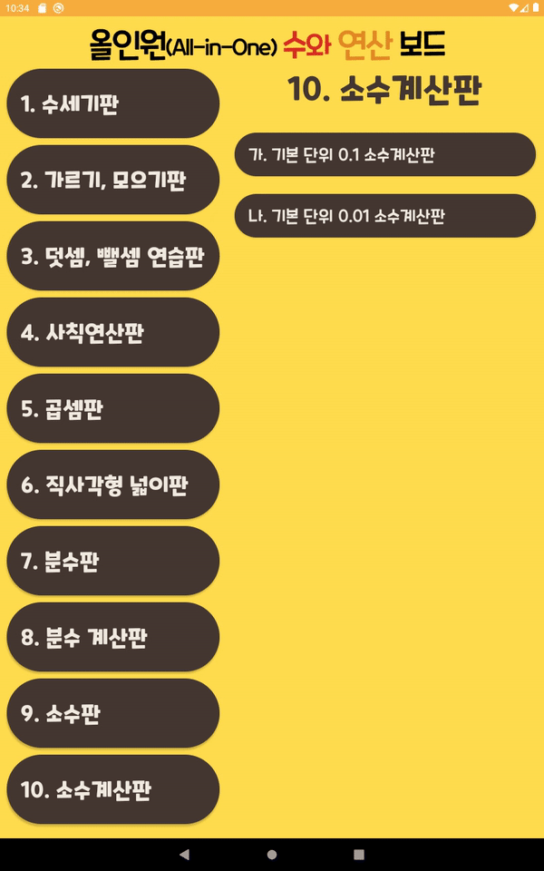

# All_in_One

초등학교 내에서 교사들이 교구를 개발하고 경진대회를 진행함. 선생님들 몇 명이서 자신들이 개발한 교구를 안드로이드 앱으로 만들 수는 없냐고 요청하셨음. 아이들에게 수의 개념을 쉽게 가르치기 위해 주판을 변형한 형태의 교구였음. 앱을 주로 운용할 디바이스는 갤럭시 탭 10.1 이었음. 갤럭시 탭 10.1 외에 다른 디바이스와 호환을 고려할 필요가 없다고 해서 반응형으로 UI를 설계하지는 않았음.

선생님들이 요청하신 목록은 다음과 같았음. 각 항목에 대해서도 세부 항목이 있었음.

- 수세기판
- 가르기, 모으기판
- 덧셈, 뺄셈 연습판
- 사칙연산판
- 곱셈판
- 직사각형 넓이 판
- 분수판
- 분수 계산판
- 소수판
- 소수계산판

이에 따라 리스트를 다음 화면과 같이 구현하였음

{: .center}{: width="100%" height="100%"}

선생님들이 교구와 그것을 어떻게 사용하는지를 기술한 메뉴얼을 주셨기 때문에 교구를 이리저리 움직이면서 어떤 기능이 필요한지 식별할 수 있었음.

- 뒷판을 만들기 위해 배경에 고정 버튼을 그리고 그 위에 숫자 그리기
- 윗판을 만들기 위해 뒷판 위, 같은 위치에 버튼을 그리기
- 버튼 클릭시 이동방향으로 인접해있는 버튼들 밀어내기
- 필요에 따라 판을 2개 또는 1개 사용할 수 있게 하기
- 기본 이동방향이 수직, 수평인 판을 필요에 따라 생성할 수 있게 하기
- 계단 모양 판처럼 보일 수 있도록 일부 버튼을 투명하게 바꾸기
- 분수판에서 n개의 버튼을 k등분해서 버튼 묶음으로 이동할 수 있게 하기

## 느낀 점

개발 기간은 약 6주가 소요되었음. 이 프로젝트를 수주받았을 때 개발 기간을 2개월로 정했는데, 생각보다 일찍 마무리해서 일정을 앞당겨 선생님들께 완성된 앱의 설치 파일을 전달하였음. 개발에 진척이 생기거나, 어떻게 구현해야 할 지 이슈가 생길 때 선생님들께 개발 경과를 보고하였음. 그때마다 매번 새로운 요구사항 또는 기존 요구사항을 뒤집는 일이 생겨 구현해놓은 것을 다시 수정해야 하는 문제가 생겼음. 여러 선생님들이 따로 요구사항을 제시하셔서 선생님들 측에서 필요한 요구사항을 합의하고 정리하여 한꺼번에 전달해달라 요청하였음. 선생님들이 완성된 앱을 전달받아 기기에 설치해 직접 테스트하셨고 요구사항이 잘 반영된데다 기대 이상으로 잘 구현되어 아주 만족스러워 하셨음.

이 앱의 기능을 구현하는데 가장 핵심이 되는 점은 바로 버튼 이동을 배열로 관리하는 것임. 배열 위의 버튼들의 상태를 서로 다른 정수로 구분하고 이 값들을 이용하여 배열을 조작하는 연산을 구현하였음. 평소에 알고리즘을 응용해서 문제를 푸는 것을 즐기는 편인데, 프론트나 UI를 구현하는 일 외에도 기능 구현할 때 문제를 정의하고 알고리즘을 설계하여 코드로 작성하는 일이 재밌었음. 선생님들이 앱을 어떻게 디자인할지 명확하게 정의해주지 않으시고 나에게 디자인을 맡기셨음. 그래서 태블릿 화면에 적합한 화면 디자인을 조사했고 템플릿을 기반으로 화면이나 버튼을 디자인하는 과정에서 많은 애정을 기울였음. 애착이 큰 앱이었는데 선생님들께서 크게 만족하셔서 정말 기뻤음.

어려운 점으로는 아무래도 선생님들의 요구사항이 계속해서 바뀌고 추가되었다는 점. 이점 때문에 이미 작성해둔 코드를 수정하거나 코드를 추가하는 일이 잦아졌는데, 이때부터 디자인 패턴에 대한 필요성을 느끼고 디자인 패턴을 공부하기 시작했음.
